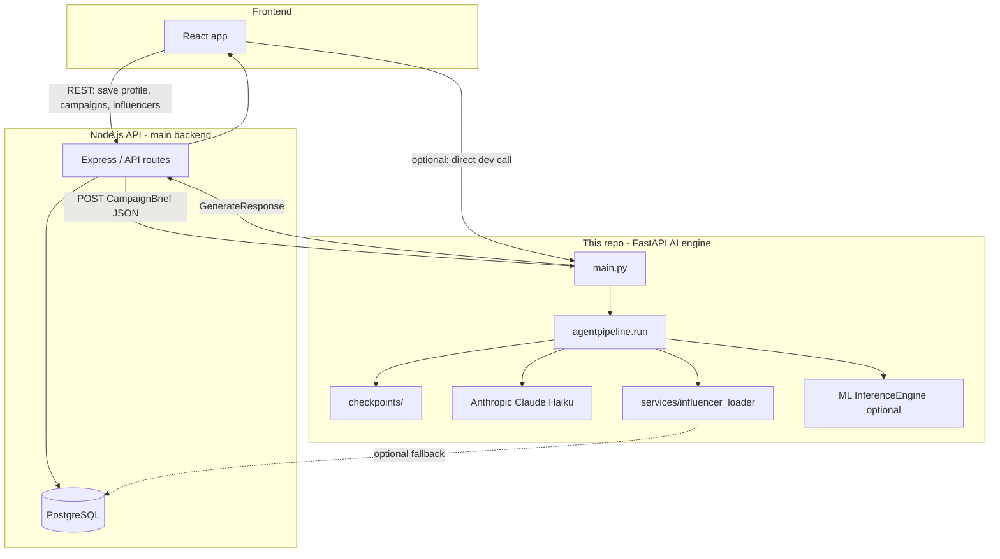

# NexBrand AI Campaign Engine

> *"From brief to viral, powered by AI."*

## Overview

This repository is the **Python FastAPI AI service** for the NexBrand / CampaignCraft graduation project. It turns a structured **CampaignBrief** into a full campaign package: business analysis, competitor and audience insights, strategy, tactical content (A/B posts), optional influencer matches, ML evaluation, and a day-by-day calendar.

The service does **not** replace your main backend. In production:

1. **React** collects the brand profile, campaign form, and tone settings.
2. **React** calls **Node.js** to persist owners, campaigns, and influencer profiles in **PostgreSQL**.
3. When the user runs “Generate campaign”, **Node.js** (or React via Node) builds a `CampaignBrief` JSON payload and **POSTs it to this engine** (`http://localhost:8000/generate` or `/generate/stream`).
4. This engine returns **`GenerateResponse`** JSON; **Node.js** may save the result back to PostgreSQL; **React** renders strategy, calendar, and influencer cards.



| Component | Responsibility |
|-----------|----------------|
| **React** | UI, forms, `buildCampaignBriefPayload`, display strategy/calendar/influencers |
| **Node.js** | Auth, CRUD, PostgreSQL (`InfluencerProfiles`, campaigns, users), orchestration |
| **PostgreSQL** | Source of truth for influencer rows and saved campaign outputs |
| **FastAPI (this repo)** | Stateless AI pipeline; checkpoints on disk per `job_id` |

---

## Pipeline (stages 1 → 2–6 → 7b → 7 → 8)

Orchestration lives in **`agentpipeline.py`** (not `pipeline.py`). Each stage implements `run(brief_dict, context, job_id) -> dict`. Outputs merge into a shared **`context`** dict and are checkpointed under **`checkpoints/{job_id}/stage_{N}.json`** (including **`stage_7b.json`**).

| Stage | Module | LLM? | Purpose |
|-------|--------|------|---------|
| **1** | `agentpipeline.run` | No | Validate and store brief |
| **2** | `stage2_business` | Claude | Business summary, tone, budget tier |
| **3** | `stage3_competitors` | Claude | Competitor gaps, channels to prioritize |
| **4** | `stage4_audience` | Claude | Persona, hooks, platform behaviour |
| **5** | `stage5_strategy` | Claude | Campaign summary, pillars, KPIs, budget split |
| **6** | `stage6_tactical` | Claude | `platform_content`, A/B posts, virality fields |
| **7b** | `stage7b_influencer` | Optional Claude | Rank influencers, outreach copy (see below) |
| **7** | `stage7_evaluation` | ML + optional Claude | `InferenceEngine` verdict + `written_explanation` |
| **8** | `stage8_calendar` | Claude | Weekly/daily calendar from stage 5–6 context |

**Mock mode:** set `USE_MOCK_LLM=true`, or use a missing/invalid `ANTHROPIC_API_KEY` (must start with `sk-ant-`). Stages 2–6 and 8 use deterministic mocks; stage 7 can skip ML with `SKIP_ML_EVALUATION=true`.

---

## Influencer loader (`services/influencer_loader.py`)

Used by **stage 7b** when the request does not supply usable inline candidates. This is a **read-only** helper; primary influencer data should still be owned by **Node.js + PostgreSQL**.

### What it does

1. **`load_influencer_candidates(limit=20)`** — main entry point called from `stage7b_influencer.run`.
2. **Cache first** — reads `data/influencer_cache.json` if the file exists and contains rows (fast, no network).
3. **PostgreSQL fallback** — if cache is empty and `INFLUENCER_USE_DB` is not disabled, connects with a **3s connect timeout** (`DB_CONNECT_TIMEOUT_SECONDS`) and runs:

   ```sql
   SELECT id, "primaryPlatform", "followersCount", "engagementRate",
          categories, "contentTypes", "collaborationTypes",
          "audienceAgeRange", "audienceGender", "audienceLocation", interests
   FROM "InfluencerProfiles"
   WHERE "isOnboarded" = true
   LIMIT :limit
   ```

4. **Normalization** — `parse_followers` / `parse_engagement` convert strings like `"84K"` and `"5.8%"` to numbers; `_normalize_row` returns a consistent dict for scoring.

5. **`save_to_file()`** — CLI helper (`python -m services.influencer_loader`) to refresh the cache from DB for offline dev.

### Environment

| Variable | Default | Purpose |
|----------|---------|---------|
| `DATABASE_URL` | local Postgres URL | Same DB Node uses (optional for AI service) |
| `INFLUENCER_USE_DB` | `true` | Set `false` to never hit Postgres from Python |
| `DB_CONNECT_TIMEOUT_SECONDS` | `3` | Avoid hanging when DB is down |

### Important

- **Node.js is the recommended path:** query onboarded influencers in Node and attach them to the POST body as `influencer_candidates` (see `test_payload.json` for shape).
- **`CampaignBrief` in `schemas.py` does not yet declare `influencer_candidates`**, so FastAPI validation may **drop** that field before the pipeline runs. Until the schema is extended, stage 7b relies on **`load_influencer_candidates()`** only. Add `influencer_candidates: list[InfluencerProfile] | None = None` to `CampaignBrief` if Node should pass rows through validation.

---

## Stage 7b — Influencer matching (`stages/stage7b_influencer.py`)

Runs **after** stage 6 (tactical content) and **before** stage 7 (ML evaluation).

### Candidate sources (in order)

1. **`brief_dict["influencer_candidates"]`** — if present after validation (from Node).
2. **`load_influencer_candidates()`** — cache file, then optional Postgres.
3. If still empty → returns `influencer_stage_skipped: true` and empty `influencer_matches`.

### Scoring (deterministic — not Claude)

`compute_influencer_score` builds a **rule-based fit score** per influencer:

| Signal | Points (approx.) |
|--------|------------------|
| Platform in campaign channels | +2.0 |
| Engagement rate (capped) | up to +3.0 |
| Follower reach (capped) | up to +2.0 |
| Category overlap with campaign | +1.5 per match |
| Audience age match | +1.5 |
| Audience gender match | +1.0 |

`rank_influencers` sorts by score; `select_top_influencers` keeps up to **3** creators with score **≥ 5.0**.

Campaign context for scoring uses `channels_to_prioritize` or `current_channels`, plus `age_range` / `gender_skew` from earlier stages when available.

### Claude’s role (optional)

If mock mode is off and there are selected matches, Claude Haiku (**max 800 tokens**) only generates:

- `strategy_note` — short overview of the creator set  
- `outreach_templates` — per-`influencer_id` outreach messages  

Fit scores and reasoning come from the **rules engine**, not the LLM.

### Response fields (merged into `GenerateResponse`)

- `influencer_matches[]` — `influencer_id`, `fit_score`, `fit_reasoning`, `suggested_collaboration_type`, `suggested_budget_usd`, `outreach_message`
- `influencer_strategy_note`
- `influencer_stage_skipped`

---

## HTTP API

| Method | Path | Description |
|--------|------|-------------|
| `GET` | `/health` | `{"status": "ok"}` |
| `GET` | `/health/detailed` | Mock mode, Anthropic configured, stage order |
| `POST` | `/generate` | Full pipeline (async, default **180s** timeout → **504** if exceeded) |
| `POST` | `/generate/stream` | SSE: `stage_complete`, `complete`, `error` (use `fetch` + `ReadableStream`, not `EventSource`) |

---

## Configuration (`.env`)

See **`.env.example`**.

| Variable | Purpose |
|----------|---------|
| `ANTHROPIC_API_KEY` | Anthropic key (`sk-ant-...` only) |
| `USE_MOCK_LLM` | `true` = no paid API calls |
| `ANTHROPIC_TIMEOUT_SECONDS` | Per-request Claude timeout (default 90) |
| `PIPELINE_TIMEOUT_SECONDS` | `/generate` wall clock (default 180) |
| `STAGE_TIMEOUT_SECONDS` | Per-stage limit on `/generate/stream` (default 120) |
| `ML_ROOT_PATH` | Folder containing `ml/pipeline/inference.py` |
| `SKIP_ML_EVALUATION` | `true` = stage 7 uses mock ML scores |
| `DATABASE_URL` / `INFLUENCER_USE_DB` | Influencer loader Postgres fallback |
| `ALLOWED_ORIGINS` | Extra CORS origins (app also allows `*`) |

---

## Running locally

```bash
python -m venv .venv
.venv\Scripts\activate          # Windows
# source .venv/bin/activate     # macOS/Linux
pip install -r requirements.txt
copy .env.example .env          # Windows
# cp .env.example .env          # macOS/Linux
# Set ANTHROPIC_API_KEY or USE_MOCK_LLM=true
uvicorn main:app --reload --port 8000
```

For full `/generate` runs (2–3 minutes), prefer **without** `--reload` so file saves do not restart the server mid-pipeline:

```bash
uvicorn main:app --port 8000
```

React dev server is typically **http://localhost:3000**; AI engine **http://localhost:8000**.

---

## Node.js + React integration

### 1. Save data in Node (PostgreSQL)

- Owner / brand profile, `BrandToneProfile`, competitors  
- Campaign rows when the user saves a draft  
- `InfluencerProfiles` when influencers complete onboarding  

### 2. Build brief in React

Map UI fields to **`CampaignBrief`** literals (exact `industry`, `campaign_goal`, `current_channels` enums — see `schemas.py`). Example helpers live in the frontend `buildCampaignBriefPayload` / `GOAL_MAP`.

### 3. Node calls the AI engine

```javascript
// Recommended: load influencers in Node from the same DB React uses
const { rows } = await db.query(`
  SELECT id, bio, "primaryPlatform", "followersCount", "engagementRate",
         categories, "contentTypes", "collaborationTypes",
         "audienceAgeRange", "audienceGender", "audienceLocation",
         interests, "socialMediaLinks"
  FROM "InfluencerProfiles"
  WHERE "isOnboarded" = true
  LIMIT 20
`);

const payload = {
  ...campaignBriefFromDbOrForm,
  influencer_candidates: rows,  // add field to CampaignBrief in schemas.py to retain this
};

const response = await fetch('http://localhost:8000/generate', {
  method: 'POST',
  headers: { 'Content-Type': 'application/json' },
  body: JSON.stringify(payload),
  timeout: 200000,  // axios: { timeout: 200000 }
});
const result = await response.json();
// Save result.strategy / result.calendar / result.influencer_matches in Node if needed
```

### 4. Streaming progress (optional)

```javascript
const res = await fetch('http://localhost:8000/generate/stream', {
  method: 'POST',
  headers: { 'Content-Type': 'application/json' },
  body: JSON.stringify(payload),
});
const reader = res.body.getReader();
const decoder = new TextDecoder();
while (true) {
  const { done, value } = await reader.read();
  if (done) break;
  for (const line of decoder.decode(value).split('\n')) {
    if (!line.startsWith('data: ')) continue;
    const event = JSON.parse(line.slice(6));
    if (event.event === 'stage_complete') updateProgress(event.progress, event.stage_name);
    if (event.event === 'complete') handleResult(event.result);
    if (event.event === 'error') handleError(event.message);
  }
}
```

---

## Key schemas (`schemas.py`)

- **`CampaignBrief`** — request body for `/generate`  
- **`BrandToneProfile`** — tone sliders and vocabulary lists  
- **`InfluencerProfile`** / **`InfluencerMatch`** — influencer shapes (match is output)  
- **`GenerateResponse`** — `strategy`, `calendar`, `influencer_matches`, `influencer_strategy_note`, `influencer_stage_skipped`  

Test fixtures: **`test_payload.json`** (with influencers), **`test_payload_no_influencers.json`**.

---

## Project layout

| Path | Role |
|------|------|
| `main.py` | FastAPI app, CORS, `/generate`, `/generate/stream`, health |
| `agentpipeline.py` | `run()`, `_run_stage()`, `CheckpointManager` |
| `schemas.py` | Pydantic models |
| `stages/` | Stage 2–8 + `stage7b_influencer.py` |
| `services/influencer_loader.py` | Cache + optional Postgres load for 7b |
| `utils/claude_client.py` | Claude JSON for stages 2–6, 7b, 8 |
| `utils/llm_client.py` | Claude JSON for stage 7 explanation |
| `utils/llm_runtime.py` | Mock mode, auth fallback, `run_llm_stage()` |
| `ml/` | ML artifacts + `pipeline/inference.py` for stage 7 |
| `data/influencer_cache.json` | Offline influencer cache for loader |
| `checkpoints/` | Per-job stage JSON (resume on retry) |
| `campaigns/` | Per-job generation log + stage outputs + final response |

---

## Campaign logs (`campaigns/`)

Each `/generate` or `/generate/stream` run writes a folder:

```
campaigns/{job_id}/
  meta.json           # status, brand, stages completed
  generation.log      # timestamped pipeline events
  brief.json          # stage 1 input
  stage_2.json … stage_8.json, stage_7b.json
  response.json       # final API payload (on success)
```

Override location with `CAMPAIGNS_DIR` in `.env`. Logs are kept even when checkpoints are cleared.

---

## Checkpoints

Captured in React/Node onboarding as **`BrandToneProfile`** (`tone_formality`, `tone_playfulness`, `tone_boldness`, preferred/avoided vocabulary). Stage 2 injects it into prompts; later stages inherit **`tone_descriptor`** / **`tone_guidelines`** from context.

---

## Checkpoints

Failed stages write `stage_failed: true`; the next run **re-executes** that stage. Successful stages reload from disk (saves API cost). Set `DEBUG_KEEP_CHECKPOINTS = False` in `agentpipeline.py` to delete checkpoints after success.

---

## Cost estimate (Claude Haiku)

Roughly **~$0.05** per full live run (~14k input + ~7k output tokens across stages). Use **`USE_MOCK_LLM=true`** for demos and CI.

---

## Known limitations

- Calendar is planning only — no live posting to Meta/TikTok/LinkedIn APIs  
- Influencer metrics are DB self-reported; no third-party verification  
- Stages run **sequentially** (parallel 3+4 possible later)  
- No auth on FastAPI — rely on Node.js JWT upstream  
- **`influencer_candidates` on POST body** requires a schema update to survive Pydantic validation  
- Competitor analysis is LLM-generated from brief data, not live web scraping  

---

## Team

Built by **Danah Safwat** — Helwan University, Computer Science / Software Engineering  
Graduation project, **2026**
