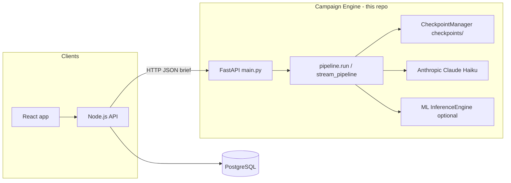

# Marketing_campaign_AI_generator

> *"From brief to viral, powered by AI."*

## Overview

NexBrand AI Campaign Engine is a **multi-stage campaign generator** built in Python. It accepts a structured **Campaign** brief (Pydantic-validated JSON), persists the brief as **stage 1**, then runs **eight downstream processing stages**—**2–6** (Claude-driven analysis, strategy, and tactical content), **7b** (optional influencer matching), **7** (ML evaluation plus narrative explanation), and **8** (calendar). Each step produces JSON merged into a shared **`context`** dict and, by default, checkpoint files under **`checkpoints/{job_id}/`**. Claude stages return strict JSON: business summary and tone, competitor gaps, audience persona, campaign strategy, **`platform_content`** with **A/B** post variants and virality fields, ranked influencers with outreach and budget splits when candidates are supplied, then a phased day-by-day calendar. The synchronous **`POST /generate`** returns **`GenerateResponse`**; **`POST /generate/stream`** emits **SSE** progress (`stage_complete`, `complete`, `error`) and the same assembled **`result`** payload at the end.

Within the broader **NexBrand AI** platform, this repository is the **FastAPI AI service**: the **React** front end and **Node.js** API gateway call these endpoints over HTTP. **PostgreSQL** is not accessed from this service—brand records, tone profiles, and influencer rows are owned by Node; **influencer candidates** are passed inline on the brief as `influencer_candidates` when stage **7b** should run. **Stage 7** optionally loads an external **ML** stack from **`ML_ROOT_PATH`** (`InferenceEngine` in `pipeline/inference.py`) for scoring and SHAP-style explanations, with Claude (via `utils/llm_client`) drafting the written explanation in real mode.

---

## Architecture



| Layer | Role |
|--------|------|
| **FastAPI** (`main.py`) | Validates `CampaignBrief`, runs `pipeline.run` or SSE `stream_pipeline`, CORS, global exception logging. |
| **`pipeline.py`** | Orchestrates `_run_stage()` for each step; merges outputs into `context`; assembles `strategy` + `final_response`. |
| **`CheckpointManager`** | Files under `checkpoints/{job_id}/stage_{N}.json` (numeric `N` or `7b`); resumes from cache when present. |
| **`stages/*.py`** | Pure functions `run(brief_dict, context, job_id) -> dict`; Claude stages use `call_claude`; mock path via `USE_MOCK_LLM`. |
| **`utils/claude_client.py`** | Shared Anthropic client, JSON fence stripping, rate-limit retry once, structured error handling. |
| **`schemas.py`** | `CampaignBrief`, `GenerateResponse`, `BrandToneProfile`, `InfluencerProfile`, `InfluencerMatch`, `StageCheckpointResponse`. |

**Data flow:** Node sends a POST body matching **`CampaignBrief`**. Stage 1 stores the brief. Each later stage reads **`brief_dict`** and accumulated **`context`** (e.g. `tone_descriptor` from stage 2 for stage 3). Stage **7b** skips with empty `influencer_matches` when `influencer_candidates` is absent. Stage **8** uses stage **5** duration and stage **6** `posting_frequency` or **`platform_content`** keys for channels.

---

## Pipeline stages

| Stage | Module | Purpose |
|-------|--------|---------|
| **1** | `pipeline.run` | Saves validated brief; no LLM. |
| **2** | `stage2_business` | Brand summary, strengths, tone, budget tier, readiness. |
| **3** | `stage3_competitors` | Landscape, gaps, positioning, channels to prioritize. |
| **4** | `stage4_audience` | Single persona JSON (pain points, hooks, `platform_behaviour`). |
| **5** | `stage5_strategy` | Campaign summary object, pillars, funnel strings, KPI objects, budget split percents. |
| **6** | `stage6_tactical` | `platform_content` per channel, A/B posts, checklist, hashtags; mock includes `posting_frequency`. |
| **7b** | `stage7b_influencer` | Ranks top influencers, budgets, outreach; skipped if no candidates. |
| **7** | `stage7_evaluation` | ML verdict + SHAP fields + `written_explanation` (requires `ML_ROOT_PATH` when not mock). |
| **8** | `stage8_calendar` | Day-by-day calendar JSON (`total_days`, `days`, …). |

---

## HTTP API

| Method | Path | Description |
|--------|------|-------------|
| `GET` | `/health` | Liveness: `{"status": "ok"}`. |
| `GET` | `/health/detailed` | Model name, mock flag, stage list `1`–`8` including `7b`, endpoint index. |
| `POST` | `/generate` | Full pipeline; response **`GenerateResponse`**. |
| `POST` | `/generate/stream` | `text/event-stream`: events `stage_complete`, `complete` (with `result`), or `error`. Clients should use **`fetch` + `ReadableStream`** (not `EventSource` for POST). |

---

## Configuration

Load environment from **`.env`** (see **`.env.example`**).

| Variable | Purpose |
|----------|---------|
| **`ANTHROPIC_API_KEY`** | Required for real Claude calls. |
| **`ANTHROPIC_MODEL`** | Optional override (default in client: `claude-haiku-4-5`). |
| **`USE_MOCK_LLM`** | `true` skips paid API and ML real path where supported. |
| **`DEBUG_LLM`** | Verbose LLM logging for `campaign_model.llm`. |
| **`ML_ROOT_PATH`** | Root of external ML project containing `pipeline/inference.py` for stage 7. |
| **`ALLOWED_ORIGINS`** | Extra CORS origins (comma-separated); app also documents localhost patterns in code. |

---

## Running locally

```bash
python -m venv .venv
.venv\Scripts\activate   # Windows
pip install -r requirements.txt
# copy .env.example to .env and set ANTHROPIC_API_KEY (and ML_ROOT_PATH for real stage 7)
uvicorn main:app --reload
```

Default app title: **Campaign Strategy Backend**. Primary integration port in CORS comments: **3000** (React).

---

## Key response shapes

- **`strategy`**: Stage 5 fields plus **`tactical_plan`** (stage 6 output) and **`influencer_strategy_note`** from stage 7b.
- **`calendar`**: Stage 8 object (`total_days`, `start_date`, `days`, …).
- **`influencer_matches`**, **`influencer_strategy_note`**, **`influencer_stage_skipped`**: From stage 7b (skipped when no candidates).

---

## Project layout (selected)

| Path | Notes |
|------|--------|
| `main.py` | FastAPI app, `/generate`, `/generate/stream`, health routes. |
| `pipeline.py` | `run()`, `_run_stage()`, `CheckpointManager`, shared `checkpoint` instance. |
| `schemas.py` | Request/response and influencer models. |
| `stages/` | One module per pipeline step after stage 1. |
| `utils/claude_client.py` | Claude Haiku JSON helper for stages 2–6 and 7b. |
| `utils/llm_client.py` | Separate Anthropic JSON helper used by stage 7 explanation path. |
| `utils/llm_runtime.py` | `use_mock_llm()`, `debug_llm()`. |
| `checkpoints/` | Per-`job_id` JSON artifacts (when `DEBUG_KEEP_CHECKPOINTS` is true in `pipeline.py`). |

---

React.js Frontend
│
│  POST /generate  (CampaignBrief JSON + influencer_candidates)
▼
FastAPI Python Backend (main.py)
│
▼
pipeline.run(brief)
│
├─ Stage 1  — Data Collection       (no LLM — reads brief + saves checkpoint)
├─ Stage 2  — Business Analysis     (Claude Haiku — tone + strengths + memory)
├─ Stage 3  — Competitor Intel      (Claude Haiku — gaps + opportunities)
├─ Stage 4  — Audience Profiling    (Claude Haiku — persona + hooks)
├─ Stage 5  — Campaign Strategy     (Claude Haiku — message + pillars + KPIs)
├─ Stage 6  — Content Generation    (Claude Haiku — A/B posts + virality scores)
├─ Stage 7b — Influencer Matching   (Claude Haiku — fit scores + outreach)
├─ Stage 7  — ML Evaluation         (InferenceEngine + Claude Haiku explanation)
└─ Stage 8  — Campaign Calendar     (Claude Haiku — posting schedule)
│
▼
GenerateResponse JSON
(strategy, calendar, influencer_matches)
│
▼
Node.js Frontend renders results
---

## Setup & Installation

```bash
# 1. Clone the repository
git clone <repo-url>
cd campaign-engine

# 2. Create and activate virtual environment
python -m venv venv
source venv/bin/activate        # Windows: venv\Scripts\activate

# 3. Install dependencies
pip install -r requirements.txt

# 4. Configure environment
cp .env.example .env
# Open .env and set ANTHROPIC_API_KEY

# 5. Run the server
uvicorn main:app --reload --port 8000
```

---

## Environment Variables

| Variable | Description | Required |
|----------|-------------|----------|
| `ANTHROPIC_API_KEY` | Your Anthropic API key (get from console.anthropic.com) | ✅ Yes |
| `ALLOWED_ORIGINS` | Comma-separated CORS origins (e.g. `http://localhost:3000`) | No |
| `ML_ROOT_PATH` | Absolute path to ML project containing `pipeline/inference.py` | For Stage 7 real mode |
| `USE_MOCK_LLM` | Set to `true` to skip all Claude calls and return mock data | No |
| `DEBUG_LLM` | Set to `true` for verbose LLM request/response logging | No |

---

## API Endpoints

### `GET /health`
Basic health check.
**Response:** `{"status": "ok"}`

### `GET /health/detailed`
Detailed status including model name, mock mode, and stage list.
**Response:** `{"status": "ok", "claude_model": "claude-haiku-4-5", "mock_mode": false, "stages": [...]}`

### `POST /generate`
Run the full 8-stage pipeline synchronously and return the complete result.

**Request body:** `CampaignBrief` JSON (see Schemas section)
**Response:** `GenerateResponse` JSON

```json
{
  "strategy": { "campaign_summary": {}, "core_message": "...", ... },
  "calendar":  { "total_days": 42, "start_date": "2025-01-01", "days": [] },
  "influencer_matches": [ { "influencer_id": 1, "fit_score": 8.7, ... } ],
  "influencer_strategy_note": "...",
  "influencer_stage_skipped": false
}
```

### `POST /generate/stream`
Same as `/generate` but streams stage progress as Server-Sent Events.
Use `fetch()` with `ReadableStream` — not `EventSource` (which does not support POST body).

**SSE event types:**
| Event | Payload |
|-------|---------|
| `stage_complete` | `{"event": "stage_complete", "stage": "2", "stage_name": "Business Analysis", "progress": 18}` |
| `complete` | `{"event": "complete", "progress": 100, "result": { ...full GenerateResponse... }}` |
| `error` | `{"event": "error", "message": "Stage 6 failed — AI response error: ...", "progress": -1}` |

---

## The 8-Stage Pipeline

| Stage | Name | LLM | Key Inputs | Key Outputs Added to Context |
|-------|------|-----|-----------|------------------------------|
| 1 | Data Collection | None | CampaignBrief fields | Raw brief dict saved to checkpoint |
| 2 | Business Analysis | Claude Haiku | brand_name, USP, tone profile, past campaigns | business_summary, tone_descriptor, tone_guidelines, budget_tier, recommended_focus |
| 3 | Competitor Intelligence | Claude Haiku | competitors[], tone_descriptor, channels | content_gaps, positioning_opportunity, channels_to_prioritize |
| 4 | Audience Profiling | Claude Haiku | target_market, persona, platform behaviour | persona_name, pain_points, messaging_hooks, platform_behaviour |
| 5 | Campaign Strategy | Claude Haiku | All prior context | campaign_summary, core_message, content_pillars, kpis, budget_allocation |
| 6 | Content Generation | Claude Haiku | core_message, tone, channels, persona | platform_content (A/B posts per platform), virality scores, hashtag set |
| 7b | Influencer Matching | Claude Haiku | influencer_candidates[], budget_allocation, persona | influencer_matches[], influencer_strategy_note |
| 7 | ML Evaluation | InferenceEngine + Claude Haiku | channel, duration, budget, segment | ml_score, ml_verdict, predicted_roi, written_explanation |
| 8 | Campaign Calendar | Claude Haiku | platform_content, posting_frequency, duration | calendar days[], start_date, total_days |

---

## Brand Tone Profile

When a user completes onboarding, their brand tone is captured as a `BrandToneProfile`:

```json
{
  "tone_formality":   3,
  "tone_playfulness": 4,
  "tone_boldness":    5,
  "preferred_vocabulary": ["innovative", "community", "bold"],
  "avoided_vocabulary":   ["cheap", "discount", "basic"]
}
```

This profile is injected into the Stage 2 system prompt and flows through context into
every subsequent stage. Stages 3–6 inherit `tone_descriptor` and `tone_guidelines` so
every generated post, outreach message, and strategic recommendation matches the brand voice.

---

## Influencer Matching (Stage 7b)

Stage 7b is triggered when the Node.js backend includes `influencer_candidates` in the brief.

**How it works:**
1. Node.js queries `InfluencerProfiles WHERE isCompleted=true AND isOnboarded=true LIMIT 20`
2. The rows are serialised as `influencer_candidates` inside the POST body
3. Stage 7b formats each candidate into a compact profile string for the prompt
4. Claude Haiku scores each candidate (0–10) against the campaign persona, platforms, and budget
5. Top 3 influencers with score ≥ 5.0 are returned with fit reasoning, outreach messages, and budget split

**Fit score criteria:**
- Audience age match with persona: up to +3.0
- Platform matches priority channels: up to +2.0
- Categories align with brand industry: up to +2.0
- Engagement rate above 3%: +1.0 | above 6%: +2.0
- Collaboration types match campaign goal: +1.0

---

## A/B Content Variants & Virality Scoring

Stage 6 generates two post variants (A and B) per active platform. Each variant is scored on a 1–10 virality scale using this rubric:

| Criterion | Score |
|-----------|-------|
| Caption opens with question or bold statement | +2 |
| Clear emotional hook (curiosity, aspiration, urgency, humor) | +2 |
| Strong call to action | +1 |
| Social proof or data reference | +1 |
| Platform-native format (reel hook, carousel tease, thread) | +1 |
| Caption exceeds platform character limit | −1 |
| No hashtags (Instagram/TikTok) | −1 |

Each variant includes: caption, hashtags, visual direction, CTA, virality score, and one-sentence explanation.

---

## Campaign Memory & Learning

Stage 2 reads `has_previous_campaigns` and `previous_campaign_description` from the brief.
When past campaign data exists, it is injected into the Stage 2 user prompt as a memory block: 
If a pipeline run fails at Stage 6, re-submitting the same `job_id` resumes from Stage 6
without re-calling the API for Stages 1–5. This saves cost and time during development.

Set `DEBUG_KEEP_CHECKPOINTS=False` in pipeline.py (or via env) to auto-delete after completion.

---

## Node.js Integration Guide

### Calling /generate

```javascript
// 1. Query influencer candidates from PostgreSQL before calling the AI engine
const influencers = await db.query(`
  SELECT id, bio, "primaryPlatform", "followersCount", "engagementRate",
         categories, "contentTypes", "collaborationTypes",
         "audienceAgeRange", "audienceGender", "audienceLocation",
         interests, "socialMediaLinks"
  FROM "InfluencerProfiles"
  WHERE "isCompleted" = true AND "isOnboarded" = true
  LIMIT 20
`);

// 2. Build the full brief payload
const payload = {
  ...campaignBriefFromForm,
  influencer_candidates: influencers.rows,
};

// 3. Call the FastAPI engine
const response = await fetch('http://localhost:8000/generate', {
  method: 'POST',
  headers: { 'Content-Type': 'application/json' },
  body: JSON.stringify(payload),
});
const result = await response.json();
// result.influencer_matches contains the top 3 ranked influencers
```

### Calling /generate/stream (for live progress bar)

```javascript
const res = await fetch('http://localhost:8000/generate/stream', {
  method: 'POST',
  headers: { 'Content-Type': 'application/json' },
  body: JSON.stringify(payload),
});
const reader = res.body.getReader();
const decoder = new TextDecoder();

while (true) {
  const { done, value } = await reader.read();
  if (done) break;
  const lines = decoder.decode(value).split('\n');
  for (const line of lines) {
    if (!line.startsWith('data: ')) continue;
    const event = JSON.parse(line.slice(6));
    if (event.event === 'stage_complete') updateProgressBar(event.progress, event.stage_name);
    if (event.event === 'complete')       handleFinalResult(event.result);
    if (event.event === 'error')          handleError(event.message);
  }
}
```

---

## Cost Estimation

| Item | Estimate |
|------|----------|
| Model | Claude Haiku (`claude-haiku-4-5`) |
| Input token cost | ~$0.001 per 1K tokens |
| Output token cost | ~$0.005 per 1K tokens |
| Avg tokens per full pipeline run | ~14,000 input + ~7,000 output |
| **Cost per campaign run** | **~$0.05** |
| 100 campaigns/day | ~$5/day |
| 1,000 campaigns/day | ~$50/day |

For a graduation project demo with low traffic, cost is negligible.

---

## Known Limitations & Future Work

- **Real social media APIs** — posting is currently calendar-based planning only; actual publishing requires Meta, LinkedIn, and TikTok API integrations
- **Influencer verification** — engagement rate and follower count are self-reported in the DB; no third-party verification layer yet
- **ML model coverage** — Stage 7 InferenceEngine requires a separately trained model; USE_MOCK_LLM=true bypasses it for development
- **Async parallel stages** — stages run sequentially; Stages 3 and 4 could run in parallel for 30–40% speed improvement
- **Multi-user auth** — no authentication layer in the FastAPI engine; relies on Node.js JWT middleware upstream
- **Real competitor monitoring** — competitor analysis is AI-generated from stored data; no live web monitoring
- **Influencer pricing negotiation** — budget splits are AI suggestions; no contract or payment flow in this engine

---

## Team

Built by [Danah Safwat]
[Helwan University] — Computer Science / SoftwareEngineering
Graduation Project, [2026]

